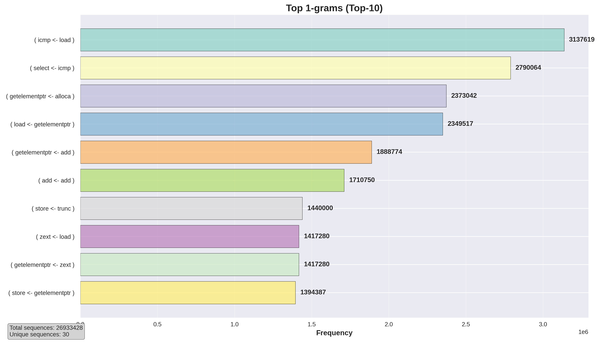
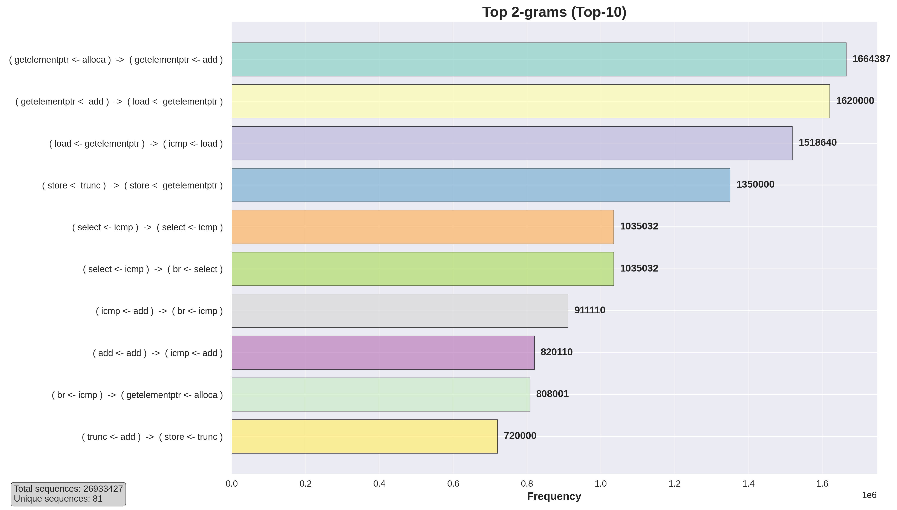
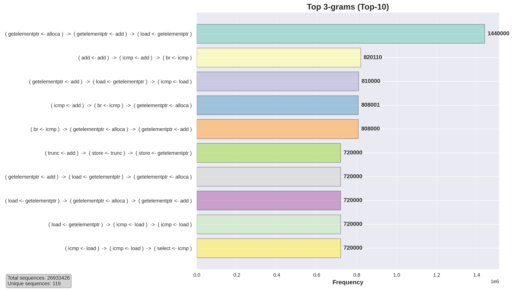
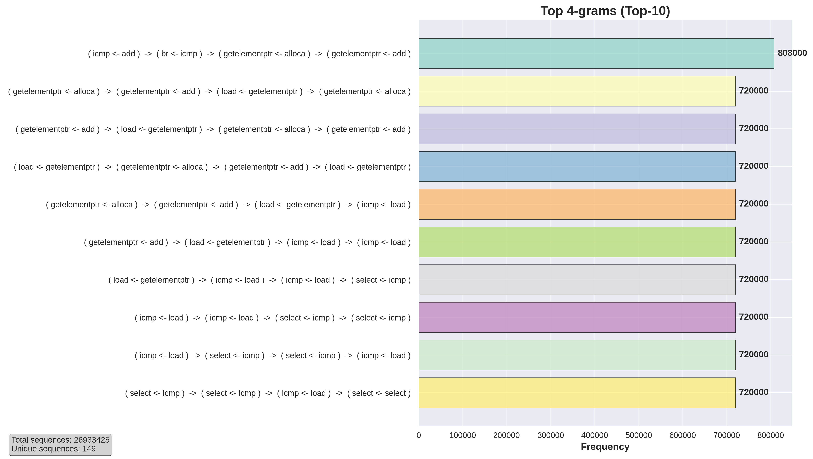
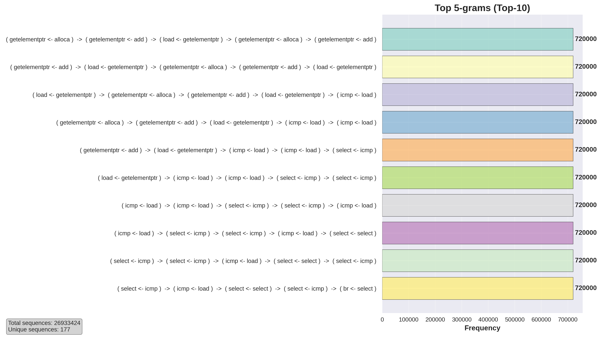

## LLVM PASS

### Description

This directory contains implementation of tracing LLVM Pass. This pass statically instruments LLVM IR file, resulting in logging of each instruction. For each LLVM IR instruction this Pass adds logging of its name and operands (if they are also instructions) in following format:
```
@instr_name <- @operand_name
```

If instruction's operand is `PHINode`, pass will print operands of this `PHiNode` instead.

## Usage

1. Build
```
mkdir build && cd build
cmake .. && make
```

2. Instrument existing source file (for example `app.c` from `graphic_app` dir)
```
clang -fpass-plugin=libPass.so app.ll -emit-llvm -S -o app_log.ll
```

3. Resume compliling as normal
```
clang app_log.ll main.c sim.c log.c -lSDL2 -o app_log
```

## Statistics

Applying this tracing pass to `app.c` from `graphic_app` directory results in `~400mb` trace file size. From it we can extract information about most common instruction + operand patterns using `analysis.py` script:










